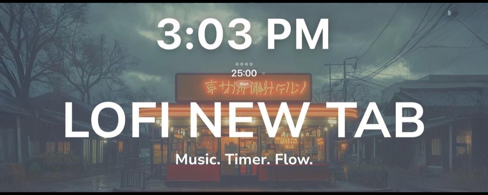
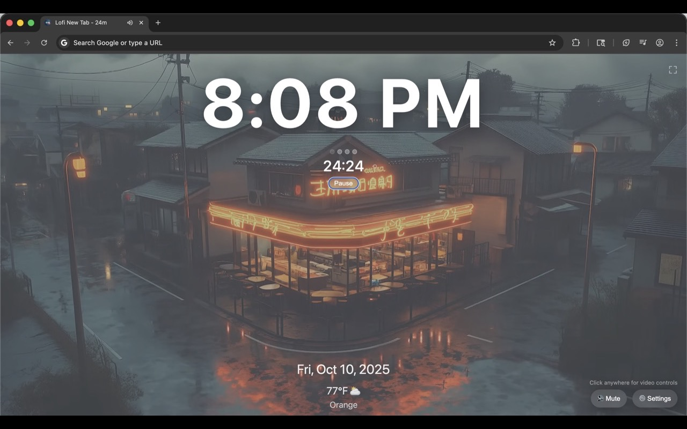
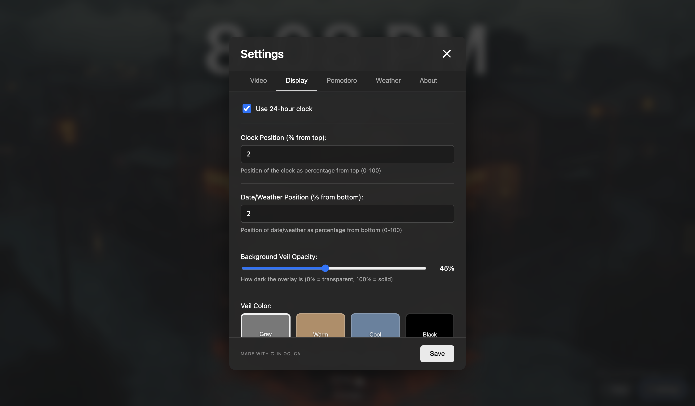
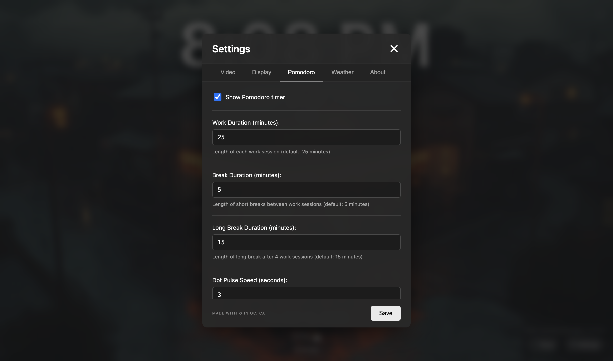
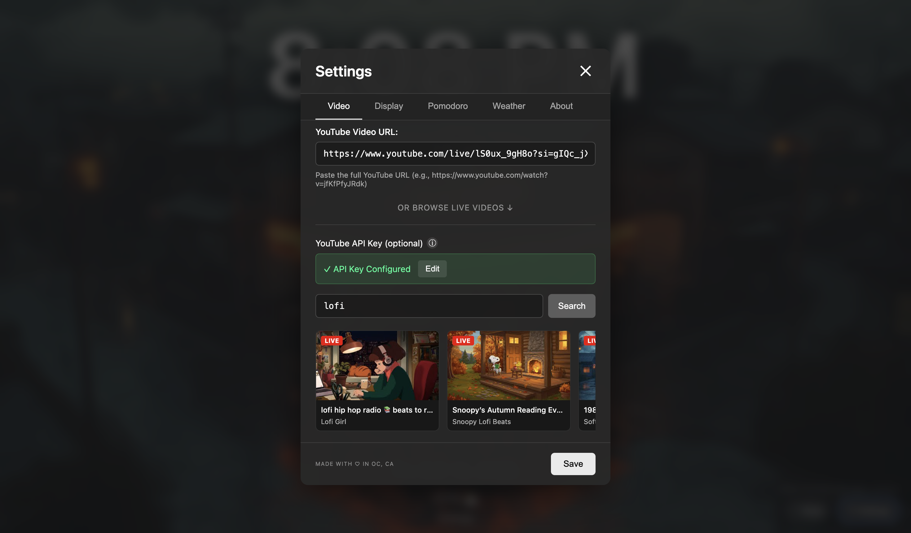

# Lofi New Tab



Lofi New Tab replaces the blank Chrome start page with a calm lofi livestream, a clean clock, optional weather, and a Pomodoro focus timer. Everything stays configurable in a single settings modal, making it a peaceful landing pad every time you open a new tab.

## Features
- Streaming lofi background with quick mute/unmute and fullscreen controls
- Customizable clock (12/24-hour), position, overlay color, and opacity
- Weather widget with Celsius/Fahrenheit and city lookup
- Pomodoro timer with adjustable work/break durations, breathing indicators, and desktop notifications
- YouTube search support when you provide your own API key
- About tab with Ko-fi link and direct contact info

## Screenshots





## Development
```bash
# Install dependencies (none required)
# Load the unpacked extension in Chrome or Edge:
chrome://extensions/ -> Developer mode -> Load unpacked -> select the repo directory

# Optional: build a release zip
zip -r lofi-newtab.zip manifest.json newtab.html newtab.css newtab.js icons
```

## Privacy
All preferences are stored in local storage or chrome.storage (sync when available). Network requests are limited to the YouTube Data API (for search and validation) and Open-Meteo (for weather). No personal data is collected or sent to the developer.

## License
MIT
